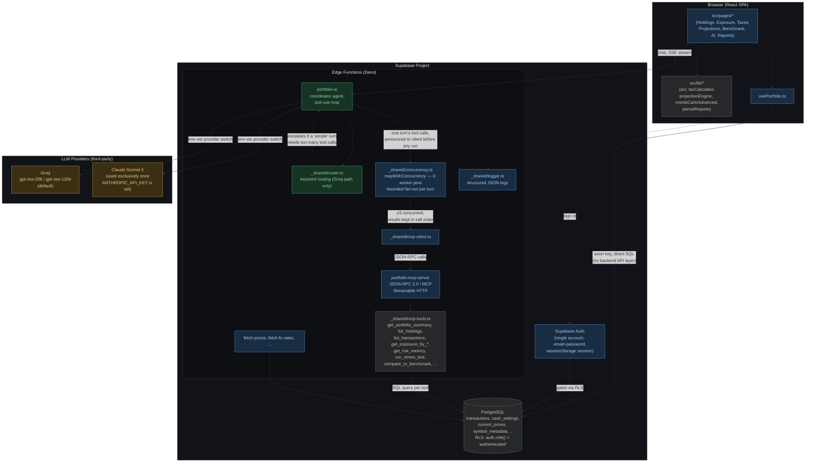

# Financial Analyst Portfolio Tracker

[](https://github.com/ak18akashrajr/financial-analyst-mcp/actions/workflows/test.yml)
[](https://github.com/ak18akashrajr/financial-analyst-mcp/actions/workflows/secret-scan.yml)
[](LICENSE)

A personal portfolio tracking and analysis application built with React, TypeScript, TailwindCSS,
and Supabase. It tracks net worth and holdings, computes tax liability, projects financial goals,
and exposes an AI assistant grounded in live portfolio data through a real Model Context Protocol
(MCP) server.

**This is a single-user application.** It is built to run against one Supabase project with one
authenticated account, not as multi-tenant SaaS — see [Architecture](#architecture) for the
rationale. It is published for its own transparency and as a reference implementation, not as a
hosted product for others to sign up to.

## Table of Contents

- [Features](#features)
- [Architecture](#architecture)
- [Technology Stack](#technology-stack)
- [Project Structure](#project-structure)
- [Local Development](#local-development)
- [Database & Edge Function Deployment](#database--edge-function-deployment)
- [Frontend Deployment (Vercel)](#frontend-deployment-vercel)
- [Testing & Continuous Integration](#testing--continuous-integration)
- [Security](#security)
- [Contributing](#contributing)
- [License](#license)

## Features

- **Net worth and cash management** — tracking of liquid/vault cash, credit card debt, provident
  fund balances, and net worth history over time.
- **Holdings and transaction tracking** — purchase/sale transaction log for stocks and other
  assets with automatic average cost basis calculation.
- **Geographic and sector exposure** — concentration risk and asset exposure broken down by
  sector, category, and geography.
- **Performance analytics** — rolling returns over configurable timeframes, currency-adjusted
  ("dollar-adjusted") returns, and a monthly seasonality heatmap.
- **Goal planning and projections** — target-based financial goals with allocations drawn from
  the active portfolio.
- **Tax dashboard** — automatic Short-Term and Long-Term Capital Gains (STCG/LTCG) calculation
  from transaction dates and applicable tax rules, including tax-loss harvesting flags.
- **Benchmark comparison** — portfolio performance against a chosen benchmark, with an
  annualized XIRR figure.
- **Portfolio AI assistant** — a conversational assistant backed by a real MCP server exposing
  live portfolio tools (holdings, exposure, risk metrics, stress tests, benchmark comparison).
  Runs on Groq (`gpt-oss-20b`/`gpt-oss-120b`, routed by query complexity) by default, or on Claude
  Sonnet 5 automatically when an Anthropic API key is configured. See
  [`docs/llm-mcp-agent-plan.md`](docs/llm-mcp-agent-plan.md) for the architecture.
- **Periodic reports** — generated quarterly/annual summaries, performance commentary, and
  outlook notes.

## Architecture

Color key: 🟢 **green** = agentic components (reason, decide, call tools) · 🔵 **blue** = deterministic
software/infra components · 🟠 **amber** = third-party LLM providers · ⚪ **gray** = data stores and leaf
endpoints.



There is exactly one Supabase Auth account for this application. Row Level Security policies gate
on `auth.role() = 'authenticated'` only; there is no `user_id`/`auth.uid()` partitioning, because
there is only ever one user. See [`docs/auth-rls-plan.md`](docs/auth-rls-plan.md) for the full
rationale. The Supabase client persists its session in `sessionStorage` rather than
`localStorage`, so a session ends when the browser tab closes.

There is no separate backend API layer for portfolio data. [`src/hooks/usePortfolio.ts`](src/hooks/usePortfolio.ts)
queries Supabase tables (`transactions`, `cash_settings`, `current_prices`, `symbol_metadata`, and
others) directly from the browser via the anon key, with all access control enforced by RLS. Every
page under [`src/pages/`](src/pages/) derives its view (holdings, exposure, tax lots, projections)
from that hook's output using pure functions in [`src/lib/`](src/lib/) (`xirr.ts`,
`taxCalculator.ts`, `projectionEngine.ts`, `monteCarloAdvanced.ts`, `periodReports.ts`, and others).

The Portfolio AI feature is a real MCP implementation, not a prose-based tool simulation.
[`supabase/functions/portfolio-mcp-server/`](supabase/functions/portfolio-mcp-server/index.ts) is a
hand-rolled JSON-RPC 2.0 / MCP "Streamable HTTP" endpoint. Its tools are registered in
[`supabase/functions/_shared/mcp-tools.ts`](supabase/functions/_shared/mcp-tools.ts)
(`get_portfolio_summary`, `list_holdings`, `get_exposure_by_*`, `get_risk_metrics`,
`run_stress_test`, `compare_to_benchmark`, and others), each backed by a SQL query.
[`supabase/functions/portfolio-ai/`](supabase/functions/portfolio-ai/index.ts) is the agent loop
that calls those tools through [`_shared/mcp-client.ts`](supabase/functions/_shared/mcp-client.ts).
Provider selection is an environment-variable switch: Groq
([`_shared/providers/groq.ts`](supabase/functions/_shared/providers/groq.ts)) is the default;
Claude Sonnet 5 ([`_shared/providers/anthropic.ts`](supabase/functions/_shared/providers/anthropic.ts))
is used instead, exclusively, once `ANTHROPIC_API_KEY` is set — both implement the same
`LlmProvider` interface. On the Groq path, [`_shared/router.ts`](supabase/functions/_shared/router.ts)
performs zero-cost keyword-based routing between `gpt-oss-20b`/`gpt-oss-120b`, with an escalation
safety net if a query classified as "simple" ends up needing too many tool calls. Full design
rationale: [`docs/llm-mcp-agent-plan.md`](docs/llm-mcp-agent-plan.md).

When a single LLM turn requests several independent tool calls at once,
[`_shared/concurrency.ts`](supabase/functions/_shared/concurrency.ts)'s `mapWithConcurrency` runs at
most 3 of them at a time (a shared cursor hands each free worker the next unclaimed call) instead of
firing them all simultaneously with `Promise.all`, so one turn can't burst
`portfolio-mcp-server`/Postgres with a large batch. Every call in the turn is still announced to the
client immediately, before any of them run; a failed call is caught and turned into an
`{ error }`-shaped result rather than aborting the batch; and results are written back at their
original index, so ordering into the LLM's context stays deterministic even though completion order
isn't.

Edge functions log through [`_shared/logger.ts`](supabase/functions/_shared/logger.ts) — one JSON
line per call (timestamp, level, function name, message, context) — rather than raw
`console.log`/`console.error`, so failures are filterable in Supabase's log explorer. See
[`docs/logging-monitoring.md`](docs/logging-monitoring.md).

## Technology Stack

| Layer | Technology |
|---|---|
| Frontend | React 18, TypeScript, Vite, TailwindCSS, shadcn/ui, Lucide icons, Recharts |
| State & data fetching | TanStack Query (React Query) |
| Backend | Supabase (PostgreSQL with Row Level Security) |
| Edge functions | Deno-based Supabase Edge Functions (pricing/FX fetches, LLM agent loop, MCP server) |
| Testing | Vitest |
| Hosting | Vercel (frontend), Supabase (database, auth, edge functions) |

## Project Structure

```text
├── docs/
│   ├── auth-rls-plan.md        # Auth + Row Level Security design record
│   ├── llm-mcp-agent-plan.md   # Portfolio AI architecture: real MCP server + multi-provider agent
│   ├── logging-monitoring.md   # Structured logging across edge functions
│   └── security-review.md     # Security review + remediation log (auth, RLS, CORS, rate limits)
├── supabase/
│   ├── migrations/             # SQL database schema and RLS policies
│   └── functions/
│       ├── _shared/               # Portfolio data/calculations, MCP tool registry, LLM provider adapters
│       ├── portfolio-mcp-server/  # Real MCP (JSON-RPC) server exposing portfolio tools
│       ├── portfolio-ai/          # Agent backend: tool-use loop against the MCP server
│       └── ...                    # fetch-prices, fetch-fx-rates, etc.
├── src/
│   ├── components/      # UI components (HoldingsTable, CashSection, charts, etc.)
│   ├── contexts/        # React context providers
│   ├── hooks/           # Custom React hooks
│   ├── integrations/    # Supabase client connection config
│   ├── lib/             # Pure calculation modules (xirr, taxCalculator, projectionEngine, etc.)
│   ├── pages/           # Page routes (Taxes, Projections, AI, Reports, etc.)
│   └── test/            # Vitest unit tests
├── .env.example          # Template for environment variables
├── index.html            # SPA root HTML
├── LICENSE                # MIT license
├── vite.config.ts        # Vite config
├── vitest.config.ts      # Vitest config (includes supabase/functions/**/*.test.ts)
└── package.json          # Dependency manifest
```

## Local Development

### Prerequisites

- [Node.js](https://nodejs.org/) v18 or later
- [Supabase CLI](https://supabase.com/docs/guides/cli/getting-started) (required for database and
  function deployments)

### 1. Install dependencies

```bash
npm install --legacy-peer-deps
```

`--legacy-peer-deps` is required: `@types/react` and `react-markdown` have a peer-dependency
conflict that otherwise fails installation.

### 2. Configure environment variables

Copy [`.env.example`](.env.example) to `.env` and fill in the values from your own Supabase
project (Project Settings → API):

```ini
SUPABASE_URL="https://your-project-ref.supabase.co"
SUPABASE_PUBLISHABLE_KEY="your-anon-key"
VITE_SUPABASE_URL="https://your-project-ref.supabase.co"
VITE_SUPABASE_PUBLISHABLE_KEY="your-anon-key"
VITE_SUPABASE_PROJECT_ID="your-project-ref"
```

These are anon/publishable keys; they are safe to expose client-side. Do not put a
`service_role` key in this file or in any `VITE_`-prefixed variable, since `VITE_` variables are
inlined into the client bundle at build time.

### 3. Run the development server

```bash
npm run dev
```

The application is served at [http://localhost:8080](http://localhost:8080).

## Database & Edge Function Deployment

To point the application at your own Supabase instance:

1. **Authenticate the CLI**

   ```bash
   npx supabase login
   ```

2. **Link the local repo**

   ```bash
   npx supabase@1.190.0 link --project-ref your-project-ref-id
   ```

   Pinning CLI `v1.190.0` avoids a strict ISO timezone-validation bug against manually created API
   keys present in later CLI versions.

3. **Deploy the database schema**

   ```bash
   npx supabase@1.190.0 db push
   ```

4. **Deploy edge functions** (deploys `portfolio-mcp-server`, `portfolio-ai`, and the rest)

   ```bash
   npx supabase functions deploy --use-api
   ```

   This is a one-time manual step for your own fork or instance. On this repository, edge function
   deploys are automated — see
   [`deploy-edge-functions.yml`](.github/workflows/deploy-edge-functions.yml): any push to `main`
   touching `supabase/functions/**` redeploys automatically. To enable this on a fork, add the
   repository secrets `SUPABASE_ACCESS_TOKEN`
   ([generate one](https://supabase.com/dashboard/account/tokens)) and `SUPABASE_PROJECT_ID`
   (your project ref) under Settings → Secrets and variables → Actions. Database schema changes
   (`db push`, step 3 above) remain manual by design — a reviewed step, not an automatic one.

5. **Set secrets for the AI agent**

   ```bash
   npx supabase secrets set GROQ_API_KEY="your_groq_key"
   ```

   `GROQ_API_KEY` is required; it backs the default provider (`gpt-oss-20b`/`gpt-oss-120b`, routed
   by query complexity). To use Claude Sonnet 5 instead, also set:

   ```bash
   npx supabase secrets set ANTHROPIC_API_KEY="your_anthropic_key"
   ```

   When `ANTHROPIC_API_KEY` is present, the agent uses Claude exclusively; no code change is
   required to switch. See [`docs/llm-mcp-agent-plan.md`](docs/llm-mcp-agent-plan.md) for details.

6. **Create a login account.** The application is gated by real Supabase Auth (email + password),
   single-user, with no signup flow in the app itself. Create one account under your project's
   Supabase Dashboard → Authentication → Users → Add user. The session is scoped to the browser
   tab and expires when it closes rather than persisting indefinitely. See
   [`docs/auth-rls-plan.md`](docs/auth-rls-plan.md) for the full security rationale.

## Frontend Deployment (Vercel)

Once the steps above are complete, the backend (Supabase) is already reachable; the remaining
piece is hosting the built static frontend.

1. Push the repository to GitHub (Vercel deploys from the connected branch on every push).
2. Import the repository on [vercel.com](https://vercel.com) → New Project. Vercel auto-detects
   Vite; [`vercel.json`](vercel.json) pins the build command and adds the SPA rewrite rule
   react-router requires (all paths fall back to `index.html`).
3. Set environment variables in Vercel → Project Settings → Environment Variables, matching the
   local `.env` values (the anon key is safe to expose client-side):

   ```
   VITE_SUPABASE_URL
   VITE_SUPABASE_PUBLISHABLE_KEY
   VITE_SUPABASE_PROJECT_ID
   ```

4. Deploy. Vercel provides a `https://<project>.vercel.app` URL over HTTPS, redeploying
   automatically on every push to `main`. A custom domain can be attached under Project Settings →
   Domains.
5. **Lock down edge function CORS to this origin.** Every edge function defaults to
   `Access-Control-Allow-Origin: *` until you set an `ALLOWED_ORIGIN` secret, so the app works
   immediately after step 4 above with no extra step required — but a fresh deploy should still
   restrict it once the real frontend URL is known:

   ```bash
   npx supabase secrets set ALLOWED_ORIGIN="https://<project>.vercel.app"
   ```

   Use the exact origin (scheme + host, no trailing slash, no path) — a mismatch here breaks every
   edge function call from the browser with a CORS error, not an auth error, which is easy to
   misdiagnose. If you attach a custom domain later, update this secret to match. See
   [`docs/security-review.md`](docs/security-review.md) finding #4 for why this exists.

## Testing & Continuous Integration

Every pull request into `main` must pass three required checks before it can be merged: the Vitest
suite, a TypeScript typecheck, and a Gitleaks secret scan.

```bash
npm test                                   # Vitest suite (frontend + edge functions)
npx tsc --noEmit -p tsconfig.app.json      # TypeScript typecheck
npm run lint                               # ESLint (not enforced in CI; pre-existing issues remain)
```

Edge functions under `supabase/functions/` are tested through the same `vitest.config.ts`
configuration as the frontend — it includes `supabase/functions/**/*.test.ts` and aliases the Deno
`esm.sh` Supabase import to the npm package, so the same source runs under Vitest/Node and the Deno
edge runtime without a separate test command.

To run a single test file or a single test by name:

```bash
npx vitest run src/test/exposure-section.test.tsx
npx vitest run -t "shows empty-state copy"
```

## Security

[`docs/security-review.md`](docs/security-review.md) is a full security review of the
application — auth flow, RLS policies, edge function CORS/rate-limiting/error handling, LLM
tool-call safety, and dependency vulnerabilities — plus a remediation log of what's been fixed and
when. Relevant to a first-time setup:

- **`ALLOWED_ORIGIN`** (edge function secret) restricts CORS to your actual frontend origin; see
  step 5 of [Frontend Deployment](#frontend-deployment-vercel) above. The app works without it
  (defaults to `*`), so this isn't a blocking step, just one worth doing once your Vercel URL
  exists.
- **`portfolio-ai` is rate-limited** to 10 requests per user per minute, backed by the
  `ai_rate_limits` table (created automatically by the `db push` step above — nothing extra to
  configure).
- **`SUPABASE_ANON_KEY`** is read by edge functions to verify real user sessions
  (`supabase/functions/_shared/auth.ts`); it's one of the secrets Supabase injects into every edge
  function by default, so — like `SUPABASE_URL`/`SUPABASE_SERVICE_ROLE_KEY` — nothing needs to be
  set for it manually.

See also [`docs/auth-rls-plan.md`](docs/auth-rls-plan.md) for the auth/RLS design this review
builds on.

## Contributing

This is a personal, single-maintainer project, but the workflow below is enforced for any change:

- Never commit directly to `main`. Branch off `main` and open a pull request; merge only once all
  three required checks pass (Vitest, TypeScript typecheck, Gitleaks secret scan).
- Every feature or fix branch adds or updates tests covering what changed. This is a project
  convention, not a CI-enforced rule.
- Delete the branch (local and remote) once its pull request merges.

## License

Released under the [MIT License](LICENSE).
